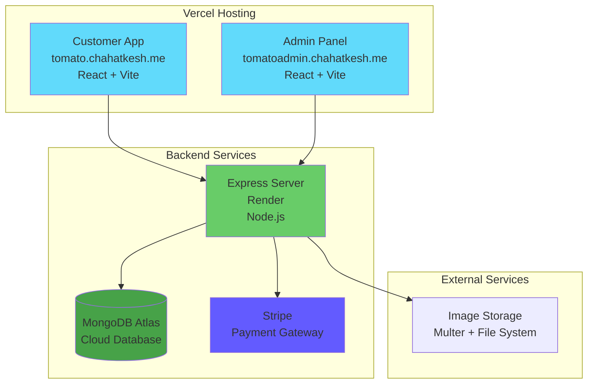
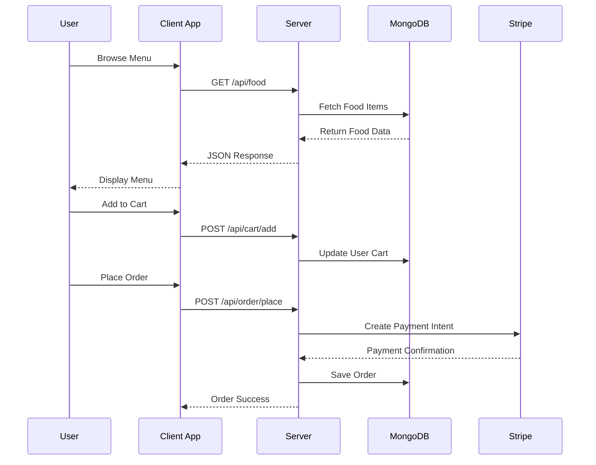

# Food Delivery App


[](https://nodejs.org/)
[](https://reactjs.org/)
[](https://expressjs.com/)
[](https://www.mongodb.com/)
[](https://stripe.com/)
[](https://vitejs.dev/)

> A full-stack food delivery application built with the MERN stack, featuring real-time order management, secure payment processing, and comprehensive admin controls.

## 🌐 Live Demo

🚀 **Deployed Applications:**
- **Customer App**: [tomato.chahatkesh.me](https://tomato.chahatkesh.me) - Browse and order food
- **Admin Panel**: [tomatoadmin.chahatkesh.me](https://tomatoadmin.chahatkesh.me) - Manage orders and menu
- **Backend API**: Deployed on Render - Powers both applications

> **Note**: The applications are fully functional with real payment processing via Stripe. Feel free to explore the demo!

## ✨ Features

### 🛍️ Customer Features
- **Browse Menu** - Explore food categories and items with detailed descriptions
- **Shopping Cart** - Add/remove items with quantity management
- **User Authentication** - Secure login and registration with JWT
- **Order Placement** - Complete checkout with delivery information
- **Payment Integration** - Secure payments powered by Stripe
- **Order Tracking** - Real-time order status updates
- **Order History** - View past orders and reorder favorite items

### 👨‍💼 Admin Features
- **Food Management** - Add, edit, and delete menu items with image uploads
- **Order Management** - View and update order statuses in real-time
- **Analytics Dashboard** - Monitor sales and order metrics
- **Inventory Control** - Manage food item availability

## 🏗️ Architecture Overview



## 🚀 Tech Stack

### Frontend
- **React 18.3.1** - Modern UI library with hooks
- **React Router DOM** - Client-side routing
- **Axios** - HTTP client for API calls
- **Vite** - Fast build tool and development server
- **CSS3** - Custom styling with responsive design

### Backend
- **Node.js** - JavaScript runtime environment
- **Express.js** - Web application framework
- **MongoDB** - NoSQL database with Mongoose ODM
- **JWT** - JSON Web Tokens for authentication
- **Multer** - File upload middleware
- **bcrypt** - Password hashing
- **CORS** - Cross-origin resource sharing

### Payment & External Services
- **Stripe** - Payment processing platform
- **Dotenv** - Environment variable management

## 📊 Data Flow



## 🗂️ Project Structure

```
food-delivery-app/
├── 📁 server/                  # Backend API
│   ├── 📁 config/             # Database configuration
│   ├── 📁 controllers/        # Business logic
│   ├── 📁 middleware/         # Auth & validation
│   ├── 📁 models/             # Database schemas
│   ├── 📁 routes/             # API endpoints
│   ├── 📁 uploads/            # Food images
│   ├── 📄 server.js           # Main server file
│   └── 📄 .env.example        # Environment template
├── 📁 client/                 # Customer frontend
│   ├── 📁 src/
│   │   ├── 📁 components/     # Reusable UI components
│   │   ├── 📁 pages/          # Page components
│   │   ├── 📁 context/        # Global state management
│   │   └── 📁 assets/         # Images & icons
│   └── 📄 package.json
├── 📁 admin/                  # Admin panel
│   ├── 📁 src/
│   │   ├── 📁 components/     # Admin UI components
│   │   └── 📁 pages/          # Admin pages
│   └── 📄 package.json
└── 📄 README.md
```

## 🛠️ Installation & Setup

### Prerequisites
- Node.js 18.x or higher
- npm or yarn
- MongoDB database
- Stripe account for payments

### 1. Clone the Repository
```bash
git clone <repository-url>
cd food-delivery-app
```

### 2. Environment Setup
Create `.env` file in the server directory:
```bash
cp server/.env.example server/.env
```

Configure your environment variables:

#### Development Environment
```env
JWT_SECRET=your_super_secret_jwt_key
STRIPE_SECRET_KET=sk_test_your_stripe_test_key
MONGODB_URI=mongodb://localhost:27017/food-delivery
FRONTEND_URL=http://localhost:5173
PORT=4000
```

#### Client Environment (.env)
```env
VITE_SERVER_URL=http://localhost:4000
```

#### Admin Environment (.env)
```env
VITE_SERVER_URL=http://localhost:4000
```

> **Production Note**: For production deployment, update the URLs to match your deployed services:
> - Frontend URLs: `https://tomato.chahatkesh.me` and `https://tomatoadmin.chahatkesh.me`
> - Backend URL: Your Render deployment URL

### 3. Install Dependencies

#### Server Setup
```bash
cd server
npm install
```

#### Client Setup
```bash
cd client
npm install
```

#### Admin Panel Setup
```bash
cd admin
npm install
```

### 4. Start Development Servers

#### Start Backend Server
```bash
cd server
npm run server
```

#### Start Client Application
```bash
cd client
npm run dev
```

#### Start Admin Panel
```bash
cd admin
npm run dev
```

## 🌐 API Endpoints

### Authentication
- `POST /api/user/register` - User registration
- `POST /api/user/login` - User login

### Food Management
- `GET /api/food/list` - Get all food items
- `POST /api/food/add` - Add new food item (Admin)
- `POST /api/food/remove` - Remove food item (Admin)

### Cart Operations
- `POST /api/cart/add` - Add item to cart
- `POST /api/cart/remove` - Remove item from cart
- `POST /api/cart/get` - Get cart items

### Order Management
- `POST /api/order/place` - Place new order
- `POST /api/order/verify` - Verify payment
- `POST /api/order/userorders` - Get user orders
- `GET /api/order/list` - Get all orders (Admin)
- `POST /api/order/status` - Update order status (Admin)

## 🎨 UI Components

### Customer App Components
- **Navbar** - Navigation with cart icon and user menu
- **Header** - Hero section with call-to-action
- **ExploreMenu** - Category-based food filtering
- **FoodDisplay** - Grid layout for food items
- **FoodItem** - Individual food card with add/remove functionality
- **Cart** - Shopping cart with checkout
- **LoginPopup** - Authentication modal

### Admin Panel Components
- **Sidebar** - Navigation menu for admin functions
- **Add** - Food item creation form
- **List** - Food items management table
- **Orders** - Order status management interface

## 🔐 Security Features

- **JWT Authentication** - Secure user sessions
- **Password Hashing** - bcrypt encryption
- **Input Validation** - Server-side validation
- **CORS Protection** - Cross-origin request handling
- **Environment Variables** - Sensitive data protection

## 🚀 Deployment

### Live Applications

The application is deployed and accessible at the following URLs:

#### 🛍️ Customer Application
- **URL**: [tomato.chahatkesh.me](https://tomato.chahatkesh.me)
- **Platform**: Vercel
- **Features**: Browse menu, place orders, track deliveries

#### 👨‍💼 Admin Panel
- **URL**: [tomatoadmin.chahatkesh.me](https://tomatoadmin.chahatkesh.me)
- **Platform**: Vercel
- **Features**: Manage food items, process orders, view analytics

#### 🔧 Backend API
- **Platform**: Render
- **Database**: MongoDB Atlas
- **Environment**: Production
- **Features**: RESTful API, secure authentication, payment processing

### Environment Configuration

For production deployment, ensure these environment variables are set:

#### Server (.env)
```env
JWT_SECRET=your_production_jwt_secret
STRIPE_SECRET_KET=sk_live_your_stripe_live_key
MONGODB_URI=your_mongodb_atlas_connection_string
FRONTEND_URL=your_frontend_url
PORT=4000
```

#### Client (.env)
```env
VITE_SERVER_URL=your_backend_url
```

#### Admin (.env)
```env
VITE_SERVER_URL=your_backend_url
```

### Production Build Commands
```bash
# Build client application
cd client && npm run build

# Build admin panel
cd admin && npm run build

# Start production server
cd server && npm start
```

### Vercel Deployment

Both the client and admin applications are deployed on Vercel with custom domains:

#### Prerequisites for Vercel Deployment
- Vercel account
- GitHub repository connected to Vercel
- Custom domain configured (optional)

#### Vercel Configuration Files
Both applications include `vercel.json` configuration files with:
- **Framework**: Vite detection
- **Build Command**: `npm run build`
- **Output Directory**: `dist`
- **SPA Routing**: All routes redirect to `index.html` for client-side routing

#### Deployment Steps
1. **Connect Repository**: Link your GitHub repo to Vercel
2. **Environment Variables**: Set up environment variables in Vercel dashboard
3. **Custom Domain**: Configure custom domains (tomato.chahatkesh.me, tomatoadmin.chahatkesh.me)
4. **Auto Deploy**: Push to main branch triggers automatic deployment

#### Environment Variables in Vercel
Set these in the Vercel dashboard for each project:

**Client Project:**
```
VITE_SERVER_URL=https://your-backend-api-url.onrender.com
```

**Admin Project:**
```
VITE_SERVER_URL=https://your-backend-api-url.onrender.com
```

### Deployment Checklist
- ✅ Environment variables configured
- ✅ Database connection established (MongoDB Atlas)
- ✅ Payment gateway configured (Stripe)
- ✅ File upload directory created
- ✅ CORS configured for production domains
- ✅ SSL certificates enabled (HTTPS)
- ✅ Domain names configured and pointed to hosting

## � Acknowledgments

- React team for the amazing library
- Express.js for the robust backend framework
- MongoDB for the flexible database solution
- Stripe for seamless payment processing
- Vite for the lightning-fast build tool

---

<div align="center">
  <p>Made with ❤️ for food lovers everywhere</p>
  <p>
    <a href="#-food-delivery-app">⬆ Back to top</a>
  </p>
</div>
